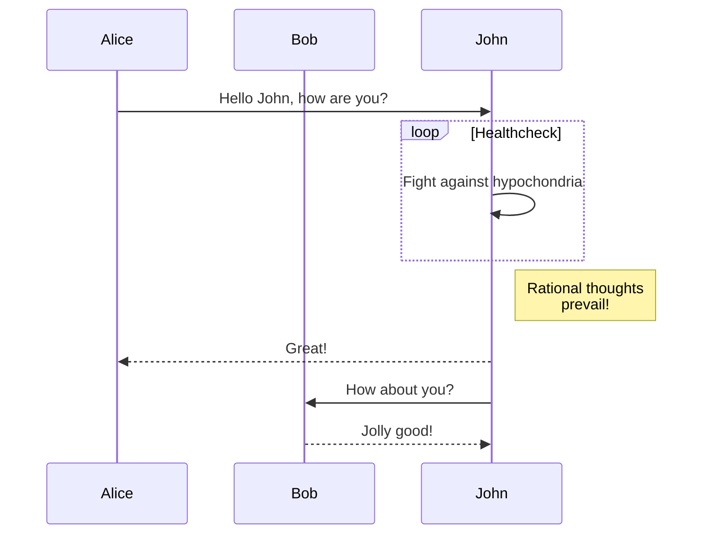

# Userstory-003.
### To add an image write this markdown code as following, replace the local image file with your filename.
### Example: 
###


# gruppgit


# UserStory-007

*John Was here*
**John left**

# UserStory-015

This word is <div "background-color: #FFFF00">highlighted</div>


# UserStory-006


| Tables   |      Are      |  Cool |
|----------|:-------------:|------:|
| col 1 is |  left-aligned | $1600 |
| col 2 is |    centered   |   $12 |
| col 3 is | right-aligned |    $1 |


# userstory 11
   > Markdown blockquote  
   > Blabla  
   > Blabla  


# Userstory 01

```js

let a = "Hello World;

```

# Userstory-002

>I don’t need a hair stylist, my pillow gives me a new hairstyle every morning.

# Userstory 03

[MarineGEO circle logo](/assets/img/MarineGEO_logo.png "MarineGEO logo") 

# Userstory 05

[Google Search Engine](https://www.google.se/).


extra: 
Userstory-019:
#### As a Devops,
#### I want to
#### Learn to code like a pro,
#### Have a Galeon 400 and
#### Maybe eat pizza every day.
##### ps. I'm low carb carnivore ;) 


# Userstory 05

[Google Search Engine](https://www.google.se/).

# Userstory 16

##### ps. I'm low carb carnivore ;)

